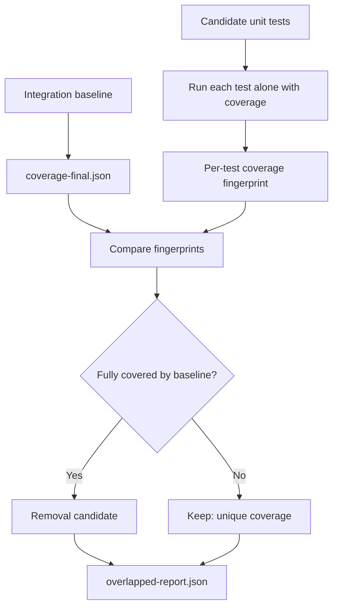

# overlapped

Find the unit tests your AI agent wrote twice.

`overlapped` finds unit tests whose statement and branch coverage is already covered by a baseline suite, usually integration, e2e, or provider tests.

It runs each candidate unit test in isolation, compares its coverage against the baseline, and reports tests that are candidates to remove.

Use it when a test suite has grown in bulk, especially after AI-assisted test generation, and you want to keep the tests that still carry signal.

Supports **Vitest** and **Jest** out of the box. The runner is auto-detected from your project dependencies.

## Quick Start

1. Split your test scripts into unit tests and integration tests:

```json
{
  "scripts": {
    "test:unit": "vitest run src",
    "test:integration": "vitest run test/integration"
  }
}
```

`overlapped` uses `test:integration` and `test:unit` as conventions for zero-config runs.

2. Run the analyzer:

```bash
npx overlapped analyze
```

Example output:

```text
=== overlapped ===

Total tests analyzed: 312
100% overlapped candidates: 27
Tests with unique coverage: 285

Files where every test is a removal candidate (2):
  src/__tests__/legacy-client.test.ts
  src/utils/__tests__/formatters.test.ts

Files with removal candidates (6):
  src/__tests__/client.test.ts: 5 candidates, 12 with unique coverage
  src/core/__tests__/validation.test.ts: 3 candidates, 9 with unique coverage

Report written to overlapped-report.json
```

Review `overlapped-report.json`, then preview removals:

```bash
npx overlapped prune --dry-run
```

Apply the cleanup when the preview looks right:

```bash
npx overlapped prune
```

Then run your full test suite with coverage and confirm thresholds still pass.

`overlapped analyze` uses `test:integration` for baseline coverage and `test:unit` to scope candidate unit tests.

Treat the report as a review queue, not an instruction to delete blindly. A test can have a fully overlapped or empty coverage fingerprint and still protect a useful contract, such as package exports, config shape, generated files, or release metadata.

## How It Works



- **Baseline run:** coverage from integration, e2e, provider tests, or an existing Istanbul `coverage-final.json`.
- **Candidate run:** each unit test runs alone with coverage.
- **Decision:** if every covered statement and branch from a unit test is already covered by the baseline, it becomes a removal candidate.

1. Runs or loads Istanbul `coverage-final.json` for the baseline suite.
2. Runs each candidate unit test in isolation with coverage.
3. Turns covered statements and branches into fingerprint keys, such as `"/src/foo.ts:s:3"` and `"/src/foo.ts:b:1:0"`.
4. Marks a test as a removal candidate only when every key in its fingerprint already exists in the baseline fingerprint.
5. Removes candidate test blocks with bracket matching. No AST, no runtime dependencies.

For example, `agent-device` used `overlapped` to [drop 151 unnecessary unit tests](https://github.com/callstackincubator/agent-device/pull/595) without losing coverage.

## Prerequisites

- **Node.js >= 22**
- **Vitest** or **Jest** installed in your project
- Coverage provider configured (e.g. `@vitest/coverage-v8` for Vitest)
- For Vitest, keep `vitest` and `@vitest/coverage-v8` on the same major version
- A baseline suite, such as integration or e2e tests, or an existing Istanbul `coverage-final.json`

## Usage

### `overlapped analyze`

Builds the overlap report. A baseline is required: use the exact `test:integration` script convention, `--reference`, `--reference-command`, or `--reference-coverage`.

Recommended setup:

```json
{
  "scripts": {
    "test:unit": "vitest run src",
    "test:integration": "vitest run test/integration"
  }
}
```

```bash
npx overlapped analyze
```

`overlapped` adds coverage flags to `test:integration`, then discovers candidate unit tests from normal Jest/Vitest test files. No `--include` or `--exclude` is needed unless your file layout is unusual.

`test:unit` is used to infer candidate scope. For example, `vitest run src` limits candidates to tests under `src/`; `vitest run --project unit` selects the `unit` project.

Named Vitest or Jest projects:

```bash
npx overlapped analyze \
  --reference integration \
  --unit unit
```

Existing baseline coverage:

```bash
npx overlapped analyze \
  --reference-coverage ./coverage/coverage-final.json
```

Custom baseline command:

```bash
npx overlapped analyze \
  --reference-command "pnpm test:integration:coverage"
```

The command must produce Istanbul `coverage-final.json`, either in `coverage/coverage-final.json` or at the path passed with `--reference-coverage`.

If your script writes coverage to a fixed path, point `overlapped` at it:

```bash
npx overlapped analyze \
  --reference-command "npm run test:coverage" \
  --reference-coverage ./coverage/integration/coverage-final.json
```

Custom unit test layout:

```bash
npx overlapped analyze \
  --include "packages/*/src/**/*.test.ts" \
  --exclude "packages/*/src/**/*.integration.test.ts"
```

Similar-looking script names such as `test-integration`, `test:e2e`, or `test:provider` are not guessed. Use `test:integration` for zero-config baseline coverage, or pass `--reference-command`.

Command flow:

- Baseline coverage comes from `test:integration`, `--reference`, `--reference-command`, or `--reference-coverage`.
- Candidate scope comes from `test:unit`, `--unit`, `--include`, or default Jest/Vitest test file patterns.
- Candidate tests are checked through the local Vitest or Jest binary, one file and one test name at a time.
- Runner binaries are resolved from the current package or a parent workspace `node_modules/.bin/`.

### `overlapped prune`

Reads the report and removes reported overlap candidates. Files where every test is a candidate are deleted entirely; mixed files get individual test blocks removed.

Always review changes with `--dry-run` first.

## Options

| Option | Description | Default |
|---|---|---|
| `--runner <vitest\|jest>` | Test runner | auto-detected |
| `--reference <name>` | Reference suite project name | — |
| `--reference-command <command>` | Command that generates reference coverage | — |
| `--reference-coverage <path>` | Path to existing `coverage-final.json` | — |
| `--unit <name>` | Unit test suite project name | inferred from `test:unit`, otherwise — |
| `--include <glob>` | Unit test file pattern (repeatable) | inferred from `test:unit`, otherwise Jest/Vitest-style `*.test.*` and `*.spec.*` files |
| `--exclude <glob>` | Unit test file pattern to exclude | common `.integration.*` and `.e2e.*` patterns |
| `--concurrency <n>` | Parallel test runs | `8` |
| `--report <path>` | Report output path | `overlapped-report.json` |
| `--dry-run` | Preview prune without modifying files | `false` |

## License

MIT

## Made at Callstack

`overlapped` is an open source project and will always remain free to use. The project has been developed in close partnership with [Callstack](https://callstack.com/), and contributed to the React Native Community.

Callstack is a group of React and React Native experts. If you need help with these or want to say hi, contact us at [callstack.com](https://callstack.com/).

Like the project? [Join the Callstack team](https://callstack.com/careers/) who does amazing stuff for clients and drives React Native Open Source!
