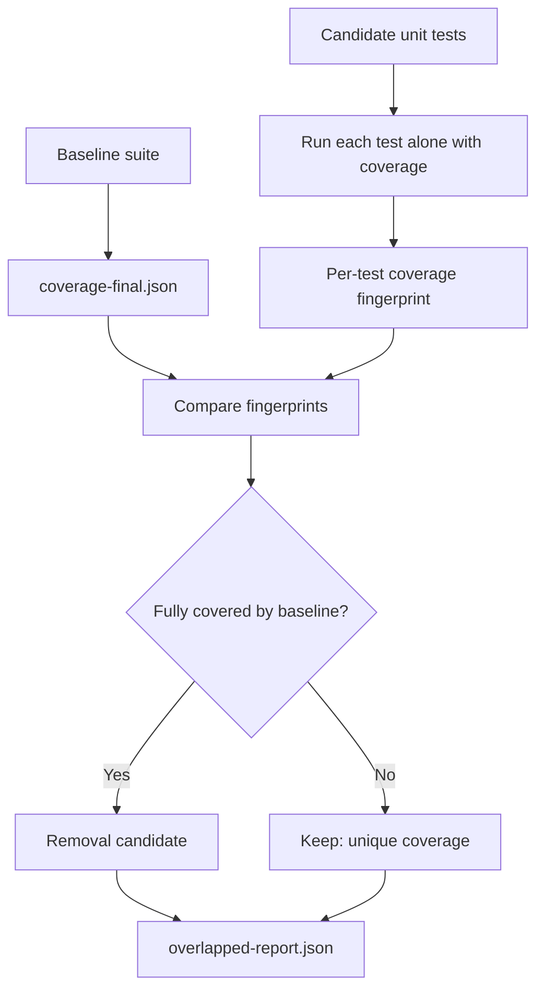

# overlapped

Find the unit tests your AI agent wrote twice.

`overlapped` detects unit tests that exercise code already covered by your baseline suite, usually integration, e2e, or provider tests. It runs each candidate test in isolation, compares its statement and branch coverage against the baseline, and reports tests that may be safe to remove.

Use it when AI-assisted test generation has inflated your suite and you want to keep the tests that still protect real behavior.

- Detects fully overlapped unit tests
- Compares against Istanbul `coverage-final.json`
- Supports Vitest and Jest
- Auto-detects your runner from project dependencies
- Generates a reviewable JSON report
- Can preview and apply removals

`overlapped` treats results as a cleanup queue, not a delete command. Some tests with overlapped or empty coverage still protect contracts such as exports, config shape, generated files, or release metadata.

## Quick Start

Split your test scripts into baseline and unit suites:

```json
{
  "scripts": {
    "test:unit": "vitest run src",
    "test:integration": "vitest run test/integration"
  }
}
```

Run the analyzer:

```bash
npx overlapped analyze
```

Example output:

```text
=== overlapped ===

Total tests analyzed: 312
100% overlapped candidates: 27
Tests with unique coverage: 285

Files where every test is a removal candidate (2):
  src/__tests__/legacy-client.test.ts
  src/utils/__tests__/formatters.test.ts

Files with removal candidates (6):
  src/__tests__/client.test.ts: 5 candidates, 12 with unique coverage
  src/core/__tests__/validation.test.ts: 3 candidates, 9 with unique coverage

Report written to overlapped-report.json
```

Review the report:

```bash
cat overlapped-report.json
```

Preview the cleanup:

```bash
npx overlapped prune --dry-run
```

Apply removals when the preview looks right:

```bash
npx overlapped prune
```

Then run your full test suite with coverage and confirm thresholds still pass.

## What It Catches

AI agents are good at producing tests that look useful. They are also good at repeating coverage you already have.

`overlapped` finds tests whose covered statements and branches are already covered by your baseline suite. That makes it useful when:

- Unit test files have grown after AI-assisted generation
- CI time is increasing without better coverage
- Integration or provider tests already exercise the same behavior
- You want a safer review queue before deleting test code
- You need evidence before pruning a large suite

For example, `agent-device` used `overlapped` to [drop 151 unnecessary unit tests](https://github.com/callstackincubator/agent-device/pull/595) without losing coverage.

## How It Works



`overlapped`:

1. Runs or loads Istanbul `coverage-final.json` for your baseline suite.
2. Runs each candidate unit test in isolation with coverage.
3. Converts covered statements and branches into fingerprint keys, such as `"/src/foo.ts:s:3"` and `"/src/foo.ts:b:1:0"`.
4. Marks a test as a removal candidate only when every key in its fingerprint already exists in the baseline fingerprint.
5. Removes candidate test blocks with bracket matching when you run `prune`.

No AST dependency is required for pruning.

## Prerequisites

- Node.js `>= 22`
- Vitest or Jest installed in your project
- Istanbul-compatible coverage output
- For Vitest, a configured coverage provider such as `@vitest/coverage-v8`
- For Vitest, `vitest` and `@vitest/coverage-v8` on the same major version
- A baseline suite such as integration, e2e, provider tests, or an existing `coverage-final.json`

## Usage

### `overlapped analyze`

Builds the overlap report.

A baseline is required. Use one of:

- `test:integration`
- `--reference`
- `--reference-command`
- `--reference-coverage`

Recommended setup:

```json
{
  "scripts": {
    "test:unit": "vitest run src",
    "test:integration": "vitest run test/integration"
  }
}
```

Then run:

```bash
npx overlapped analyze
```

With this setup, `overlapped` adds coverage flags to `test:integration` and infers candidate unit tests from `test:unit`.

Similar-looking scripts such as `test-integration`, `test:e2e`, or `test:provider` are not guessed. Use the `test:integration` convention for zero-config baseline coverage, or pass `--reference-command`.

### Named Vitest or Jest projects

```bash
npx overlapped analyze \
  --reference integration \
  --unit unit
```

### Existing baseline coverage

```bash
npx overlapped analyze \
  --reference-coverage ./coverage/coverage-final.json
```

### Custom baseline command

```bash
npx overlapped analyze \
  --reference-command "pnpm test:integration:coverage"
```

The command must produce Istanbul `coverage-final.json`, either at `coverage/coverage-final.json` or at the path passed with `--reference-coverage`.

If your script writes coverage to a fixed path:

```bash
npx overlapped analyze \
  --reference-command "npm run test:coverage" \
  --reference-coverage ./coverage/integration/coverage-final.json
```

### Custom unit test layout

```bash
npx overlapped analyze \
  --include "packages/*/src/**/*.test.ts" \
  --exclude "packages/*/src/**/*.integration.test.ts"
```

### Command Flow

- Baseline coverage comes from `test:integration`, `--reference`, `--reference-command`, or `--reference-coverage`.
- Candidate scope comes from `test:unit`, `--unit`, `--include`, or default Jest/Vitest test file patterns.
- Candidate tests are checked through the local Vitest or Jest binary, one file and one test name at a time.
- Runner binaries are resolved from the current package or a parent workspace `node_modules/.bin/`.

## Pruning Tests

### `overlapped prune`

Reads `overlapped-report.json` and removes reported overlap candidates.

Files where every test is a candidate are deleted entirely. Mixed files have individual test blocks removed.

Always preview first:

```bash
npx overlapped prune --dry-run
```

Apply removals:

```bash
npx overlapped prune
```

After pruning, run your full suite with coverage before committing.

## Options

| Option | Description | Default |
|---|---|---|
| `--runner <vitest\|jest>` | Test runner | auto-detected |
| `--reference <name>` | Reference suite project name | - |
| `--reference-command <command>` | Command that generates reference coverage | - |
| `--reference-coverage <path>` | Path to existing `coverage-final.json` | - |
| `--unit <name>` | Unit test suite project name | inferred from `test:unit`, otherwise - |
| `--include <glob>` | Unit test file pattern, repeatable | inferred from `test:unit`, otherwise Jest/Vitest-style `*.test.*` and `*.spec.*` files |
| `--exclude <glob>` | Unit test file pattern to exclude | common `.integration.*` and `.e2e.*` patterns |
| `--concurrency <n>` | Parallel test runs | `8` |
| `--report <path>` | Report output path | `overlapped-report.json` |
| `--dry-run` | Preview prune without modifying files | `false` |

## License

MIT

## Made at Callstack

`overlapped` is an open source project and will always remain free to use. It was developed by [Callstack](https://callstack.com/), the team helping companies ship cross-platform products at AI speed.

Callstack is part of the React Foundation, a long-time contributor to React Native, and helps teams build, modernize, and scale production cross-platform products, including agentic software development at scale.

Need help turning AI-assisted delivery into production software? [Book a consultation](https://callstack.com/).
